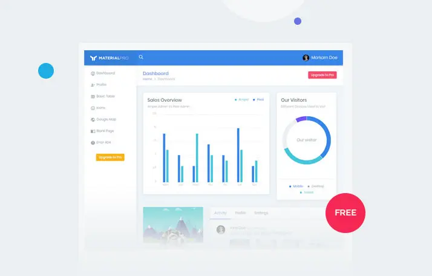
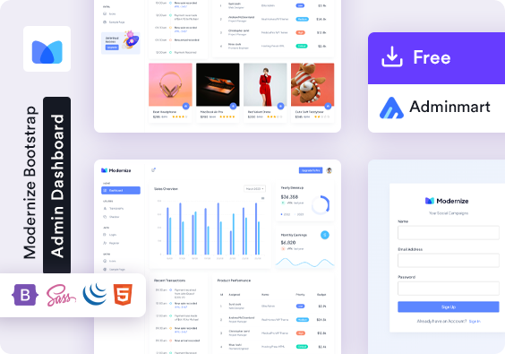
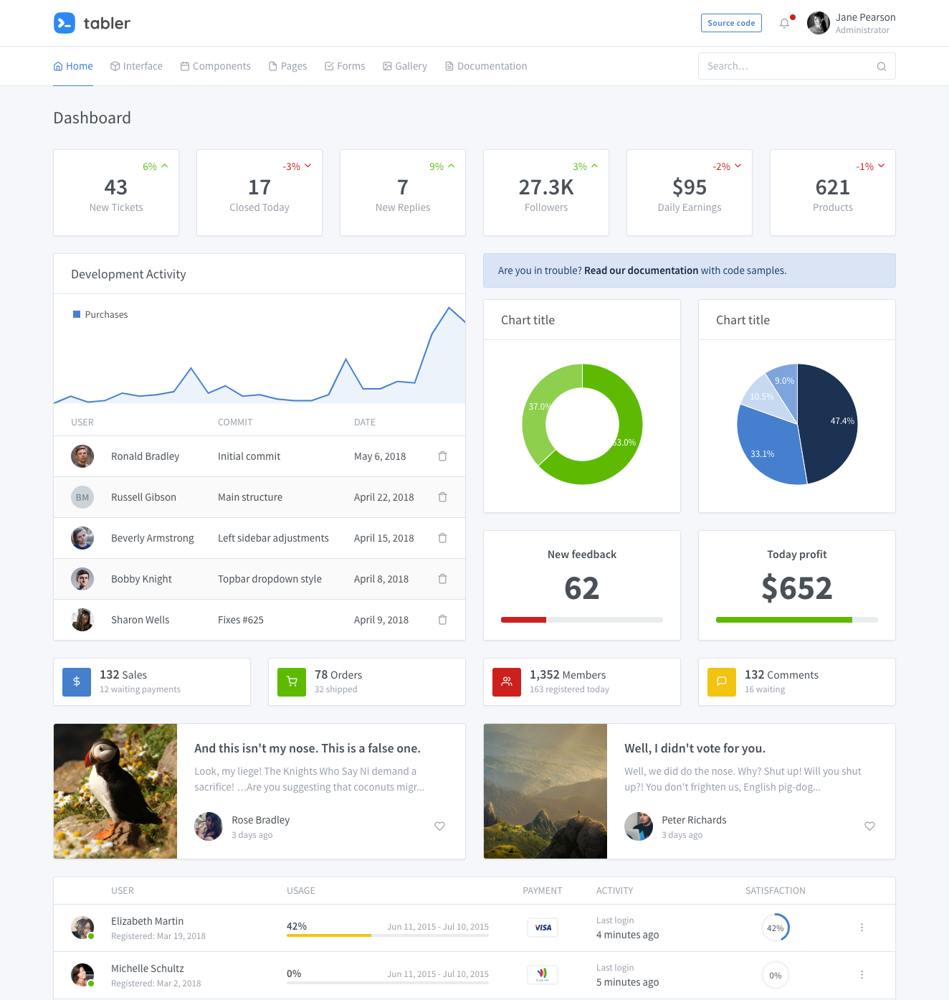

# Awesome Bootstrap  

:sparkles: Awesome - A curated list of amazing Bootstrap templates, plugins, UI Kits, tools and themes.

## Contents

- [Bootstrap 5 resources](#components)
  - [Components](#components)
  - [UI Kits](#ui-kits--libraries)
  - [Templates](#templates)
    - [Single Page Templates](#single-page-templates)
    - [Admin Dashboards](#admin-dashboards)
    - [Popular website clones](#popular-website-clones)
  - [Playgrounds](#playgrounds)
  - [Design Tools](#design-tools)

- [Bootstrap 4 resources](#bootstrap-4-resources)
  - [UI Kits](#ui-kits--libraries-1)
  - [Templates](#templates-1)
    - [Single Page Templates](#single-page-templates-1)
    - [Admin Dashboards](#admin-dashboards-1)
    - [Other themes](#other-themes) 

- [Info](#info)
  - [Contributions](#contributions)
  - [License](#license)
  - [Maintainers](#license)

---

# Bootstrap 5 resources
Resources compatible with the latest Bootstrap v5 (based on vanilla JavaScript).

## Components
- :five: [Card UX/UI](https://mdbootstrap.com/docs/standard/components/cards/) - Discover 20+ predefined templates or generate your custom card. 
- :five: [Ultimate Footer](https://mdbootstrap.com/docs/standard/navigation/footer/) - the last but not least. Learn how the bottom of your page should be at the top of your priorities 
- :five: [Tables Generator & Templates](https://mdbootstrap.com/docs/standard/data/tables/) - Use 10+ templates and present your data in a more accessible way or generate your own table
- :five: [boostrap-table](https://github.com/wenzhixin/bootstrap-table) - An extended Bootstrap table with radio, checkbox, sort, pagination, and other added features. 
- :five: [perfect-scrollbar](https://perfectscrollbar.com/) - Minimalistic but perfect custom scrollbar plugin. 
- :five: [Tab Collapse](https://github.com/flatlogic/bootstrap-tabcollapse) - MSmall bootstrap plugin that switches bootstrap tabs component to collapse component for small screens.

## UI Kits & libraries
*These aren't full out-of-the-box themes, rather, they are components you can use in your own creations.*
- :five: [Material Design for Bootstrap](https://github.com/mdbootstrap/mdb-ui-kit) - 700+ free material UI components & templates. 
- :five: [Material Design for React](https://mdbootstrap.com/docs/react/) - 700+ free material UI components & templates. 
- :five: [Material Design for Angular](https://mdbootstrap.com/docs/angular/) - 700+ free material UI components & templates. 
- :five: [Material Design for Vue](https://mdbootstrap.com/docs/vue/) - 700+ free material UI components & templates. 
- :five: [Bootstrap E-commerce](https://bootstrap-ecommerce.com/) - A powerful html library to develop e-commerce web sites with a huge set of components and templates. (free with code `awesome`)
- :five: [Bootstrap E-commerce Admin](https://bootstrap-ecommerce.com/) - Ready to use simple e-commerce dashboard templates. Admin sales dashboard ui designs with demo includes all necessary files to start project quickly. (free with code `awesome`)
- :five: [Bootstrap Menu](https://bootstrap-menu.com/) - A collection of templates for different Bootstrap 5 menu & submenu configurations. (free with code `awesome`)

## Templates
**IMPORTANT:** For items marked with  please visit their site to learn more about their license.

### Single Page Templates
| Version | Name | Screenshot | Description | LicenseInUse |
| ------- | ---- | ---------- | ----------- | ------------ |
| :five: | [Jumbtron](https://mdbootstrap.com/snippets/standard/mdbootstrap/2515510/) | | Responsive jumbotron built with the latest Bootstrap 5. A starter template with a full-width centered card at the top.||
| :five: | [Blog Categories](https://mdbootstrap.com/snippets/standard/mdbootstrap/2515508/) | | Categories page with the latest Bootstrap 5. A starter template for showing the categories of a given blog, magazine, or other kinds of pages.||
| :five: | [Pricing](https://mdbootstrap.com/snippets/standard/mdbootstrap/2515552/) | | Responsive pricing example built with the latest Bootstrap 5. This template contains tiers for different prices of products, subscriptions, or saas.||
| :five: | [Blog](https://mdbootstrap.com/snippets/standard/mdbootstrap/2515504/) | | Responsive blog built with the latest Bootstrap 5. Open source template for personal or commercial blog.||
| :five: | [Coming Soon](https://mdbootstrap.com/snippets/standard/mdbootstrap/2515515/) | | Responsive counter template built with the latest Bootstrap 5. It counts down to the given date in a "coming soon" style.||
| :five: | [Fluent Design](https://mdbgo.io/marta-szymanska/mdb5-demo-free-fluent/free/components/full-demo.html) | |Components in the newest Bootstrap 5 and Fluent Design. Completely new design using the latest Bootstrap.||
| :five: | [Login page](https://mdbootstrap.com/snippets/standard/mdbootstrap/2515540/) | | Responsive, login page template built with the latest Bootstrap 5. Signup/Registration form examples with validation.||
| :five: | [Video full-page Cover](https://mdbootstrap.com/snippets/standard/mdbootstrap/2515523/) |  | Responsive fullscreen video template built with the latest Bootstrap 5. This full-page video example will take up the entire viewport of your user screen.||
| :five: | [Bootstarters](https://www.bootstarters.com/) |  | Bootstarters - Free templates built with the latest Bootstrap 5 and  styled in accordance with Material Design 2.0 guidelines ||
| :five: | [Dark Theme](https://mdbootstrap.com/snippets/standard/mdbootstrap/2922363) |  | Dark theme for the components of the newest Bootstrap 5. Carefully selected colors, together creating a beautiful dark composition. ||
| :five: | [Page with Carousel](https://mdbootstrap.com/snippets/standard/mdbootstrap/2515519/) |  | Responsive, background-image carousel template built with the latest Bootstrap 5. Use a full-page image slider as the first thing the user sees on your website. ||
| :five: | [Image full-page cover](https://mdbootstrap.com/snippets/standard/mdbootstrap/2515521) |  | Responsive, background-image template built with the latest Bootstrap 5. Use this example of a full-page image as a header of your page. ||
| :five: | [Blog Post](https://mdbootstrap.com/snippets/standard/mdbootstrap/2515550/) |  | Responsive, blogpost example built with the latest Bootstrap 5. Use this starter template for Bootstrap blogs, articles, and posts. ||
| :five: | [Magazine](https://mdbootstrap.com/snippets/standard/mdbootstrap/2515545/) | | Responsive magazine template built with the latest Bootstrap 5. News aggregator frontpage for articles, blogposts, and more.||

### Admin Dashboards
| Version | Name | Screenshot | Description | LicenseInUse |
| ------- | ---- | ---------- | ----------- | ------------ |
|:five:| [Bootstrap 5 Admin Template](https://startbootstrap.com/template-overviews/sb-admin-2/) ||Responsive admin dashboard built with the latest Bootstrap 5. Control panel theme ideal for admin pages, analytics & configuration panels.||
|:five:| [Sneat Free Bootstrap 5 Admin Template](https://themeselection.com/products/sneat-free-bootstrap-html-admin-template/) ||Open-source & Easy to use Bootstrap 5 HTML Admin Template with Elegant Design & Unique Layout.||
|:five:| [MaterialPro Bootstrap Lite](https://www.wrappixel.com/templates/materialpro-lite/) ||The Best & Free Open-Source MaterialPro Bootstrap Templates with Features and Premium Version Option||
|:five:| [Modernize Free Bootstrap 5 Admin Template](https://adminmart.com/product/modernize-free-bootstrap-5-admin-template/) ||Free Open-Source Modernize Bootstrap Templates with Good Features and Premium Version Option||

### Popular website clones
| Version | Name | Screenshot | Description | LicenseInUse |
| ------- | ---- | ---------- | ----------- | ------------ |
|:five:|[Twitter newsfeed](https://mdbootstrap.com/snippets/standard/mdb-lab/2867455) |  |The project includes a home page with three column layout where the two extreme ones are responsible for the navigation, while the middle one i cards you can check recent user activity.||
|:five:|[Tripadvisor homepage](https://mdbootstrap.com/snippets/standard/mdb-lab/2867464) |  |The project includes a home page with one column layout with easy to use navigation in shortcuts under the navbar. The page includes also a search form & number of cards with advised the best places to rest.||
|:five:|[Wikipedia article page](https://mdbootstrap.com/snippets/standard/mdb-lab/2867452) |  |The project includes a home page with typical, advanced eCommerce navigation (double navbar + sidenav) and multiple media containers for presenting products.||
|:five:|[IMDB homepage](https://mdbootstrap.com/snippets/standard/mdb-lab/2847268) |  |The project includes a home page with typical, advanced navigation and multiple media containers for presenting news and movies.||
|:five:|[Airbnb](https://mdbootstrap.com/snippets/standard/mdb-lab/2847266) |  |The project includes two-column layout with advanced navigation of multiple media containers for presenting places to stay in area you can choose on interactive map.||
|:five:|[Facebook messenger](https://mdbootstrap.com/snippets/standard/mdb-lab/2847260) |  |The project includes typical three column layout with interface to send messages and exchange photos, videos, stickers, audio, and files, as well as react to other users' messages.||
|:five:|[Facebook profile page](https://mdbootstrap.com/snippets/standard/mdb-lab/2847258) |  |The project includes the user's profile page, along with the top navigation, cover photo, profile photo, and below that typical two-column layout with account information, and user news feed.||
|:five:|[Instagram newsfeed](https://mdbootstrap.com/snippets/standard/mdb-lab/2847257) |  |The project includes the user's newsfeed, along with the typical two-column layout, story row and navigation.||
|:five:|[YouTube homepage](https://mdbootstrap.com/snippets/standard/mdb-lab/2847265) |  |The project includes a home page with typical, advanced YouTube navigation and multiple media containers for presenting videos.||
|:five:|[Trello board](https://mdbootstrap.com/snippets/standard/mdb-lab/2847259) |  |The project includes trello board with a typical scrum system arrangement and draggable tasks.||
|:five:|[Alibaba homepage](https://mdbootstrap.com/snippets/standard/mdb-lab/2847264) |  |The project includes a home page with typical, advanced eCommerce navigation (double navbar + sidenav) and multiple media containers for presenting products.||
|:five:|[Facebook newsfeed](https://mdbootstrap.com/snippets/standard/mdb-lab/2847263) |  |The project includes the user's newsfeed, along with the typical three-column layout and social media navigation.||
|:five:|[Amazon homepage](https://mdbootstrap.com/snippets/standard/mdb-lab/2847262) |  |The project includes a home page with typical, advanced eCommerce navigation (double navbar + sidenav) and multiple media containers for presenting products.||

### Playgrounds & hosting

- [Codeply](https://www.codeply.com/p/3NtYJhNZCd) - an online editor that includes dozens of frameworks, starter templates and code snippets supports Vuetify, Bulma, Bootstrap, Foundation, MDB, Angular and Vue
- [Snippets Playground](https://mdbootstrap.com/snippets/) - free & fast online editor dedicated to Bootstrap, supports integrations with React, Angular, Vue and MDB, full of community crafted components and design blocks
- [CodePen](https://codepen.io/) - social development environment for front-end designers and developers
- [JSFiddle](https://jsfiddle.net/) - an online IDE service and online community for testing and showcasing user-created and collaborational HTML, CSS and JavaScript code snippets
- [MDB GO/CLI](https://mdbgo.com/) - frontend + backend environment. Create, deploy and host anything with a single command, offers free hosting & predesigned backend boilerplates integrated with **Bootstrap**, Angular, React, Vue, Laravel, WordPress, Express.js, MongoDB, MySQL, Tailwind, Express.js, SocketIO, Passport and more.

### Design Tools

- [Drag & Drop Builder](https://mdbootstrap.com/builder/)
- [Lab Templates](https://mdbootstrap.com/docs/standard/lab/)
- [Color Schemes generator](https://mdbootstrap.com/docs/standard/tools/design/color-schemes/)
- [ProofHub](https://www.proofhub.com/)
- [Logo generator](https://mdbootstrap.com/docs/standard/tools/design/logo-generator/)
- [Filestage](https://filestage.io/)
- [CSS Masks & Glassmorphism Generator](https://mdbootstrap.com/docs/standard/tools/design/masks/)
- [Logaster](https://www.logaster.com/logo/)
- [Instagram filters CSS generator](https://mdbootstrap.com/docs/standard/tools/design/instagram-filters/)
- [Coolors – Color scheme generator](https://coolors.co/)
- [CSS gradients generator](https://mdbootstrap.com/docs/standard/tools/design/gradients/)
- [Palleton – A color scheme](https://paletton.com/)
- [Fancy border radius generator](https://mdbootstrap.com/docs/standard/tools/design/fancy-border-radius/)
- [Diigo](https://www.diigo.com/)
- [Meta tags generator](https://mdbootstrap.com/docs/standard/tools/builders/meta-tags/)
- [Cards generator](https://mdbootstrap.com/docs/standard/tools/builders/cards/)
- [Pixlr](https://pixlr.com/)
- [Buttons generator](https://mdbootstrap.com/docs/standard/tools/builders/buttons/)
- [InVision Studio](https://www.invisionapp.com/studio)
- [Charts creator](https://mdbootstrap.com/docs/standard/tools/builders/charts/)
- [Marvel](https://marvelapp.com/)
- [Shadows generator](https://mdbootstrap.com/docs/standard/tools/design/shadows/)
- [Figma](https://www.figma.com/)
- [SVG waves generator](https://mdbootstrap.com/docs/standard/tools/design/waves/)
- [Affinity Designer](https://affinity.serif.com/en-gb/designer/)
- [Datatables builder](https://mdbootstrap.com/docs/standard/tools/builders/datatables/)
- [UXPin](https://www.uxpin.com/)
- [Alerts generator](https://mdbootstrap.com/docs/standard/tools/builders/alerts/)
- [Proto.io](https://proto.io/)
- [Modals generator](https://mdbootstrap.com/docs/standard/tools/builders/modals/)
- [MockFlow](https://www.creativebloq.com/features/best-web-design-tools)
- [Icons generator](https://mdbootstrap.com/docs/standard/tools/builders/icons/)
- [Adobe Comp](https://www.adobe.com/uk/products/comp.html)
- [Table generator](https://mdbootstrap.com/docs/standard/tools/builders/table/)
- [Flinto](https://www.flinto.com/)
- [Flexbox generator](https://mdbootstrap.com/docs/standard/tools/builders/flexbox/)
- [Justinmind](https://www.justinmind.com/)
- [Footer generator](https://mdbootstrap.com/docs/standard/tools/builders/footer/)
- [Canva](https://www.canva.com/about/)
- [Navbar generator](https://mdbootstrap.com/docs/standard/tools/builders/navbar/)
- [Orion Icon](https://orioniconlibrary.com/)
- [Typography generator](https://mdbootstrap.com/docs/standard/tools/builders/typography/)
- [Squoosh](https://squoosh.app/)
- [Grid generator](https://mdbootstrap.com/docs/standard/tools/builders/grid/)
- [Animation generator](https://mdbootstrap.com/docs/standard/tools/builders/animations/)
- [Ripple generator](https://mdbootstrap.com/docs/standard/tools/builders/ripple/)
- [Button Generator](https://bootstrapbuttons.com)

---

# Bootstrap 4 resources
Resources compatible with the older Bootstrap v4 (based on jQuery).

## Components

## UI Kits & libraries
- :four: [Bootstrap 4 & jQuery 3](https://mdbootstrap.com/docs/b4/jquery/) - 600+ free material UI components & templates. 
- :four: [Bootstrap 4 & Angular 10](https://mdbootstrap.com/docs/b4/angular/) - 400+ free material UI components & templates. 
- :four: [Bootstrap 4 & React 16](https://mdbootstrap.com/docs/b4/react/) - 500+ free material UI components & templates. 
- :four: [Bootstrap 4 & Vue 2](https://mdbootstrap.com/docs/b4/vue/) - 400+ free material UI components & templates. 
- :four: [Bootstrap-Vue](https://github.com/pi0/bootstrap-vue) Complete Components For Vue.js 2. 2.x compatible 
- :four: [ng-bootstrap](https://github.com/ng-bootstrap/ng-bootstrap) Angular directives specific to Bootstrap 4 (Angular 2) 
- :four: [reactstrap](https://github.com/reactstrap/reactstrap) - Stateless React Components for Bootstrap 4. 
- :four: [CodexUI](https://codexui.com/) [[1]](#full-disclosure) - Vanilla Bootstrap components that require no extra CSS or Javascript to use. 
- :four: [Pixel UI Kit](https://github.com/themesberg/pixel-bootstrap-ui-kit) - Premium collection of Bootstrap components and 4 example pages. 
- :four: [django-bootstrap-customizer](https://github.com/johnfraney/django-bootstrap-customizer) - Customizable Bootstrap 4 generator for Django. 

## Templates
**IMPORTANT:** For items marked with  please visit their site to learn more about their license.

### Single Page Templates
| Version | Name | Screenshot | Description | LicenseInUse |
| ------- | ---- | ---------- | ----------- | ------------ |
| :four: | [Landing Page](http://startbootstrap.com/landing-page) |  |Landing Page is a responsive landing page theme for Bootstrap 4.||
| :four: | [Stylish portfolio](http://startbootstrap.com/template-overviews/stylish-portfolio/) |  |Stylish Portfolio is a one page Bootstrap portfolio theme with off canvas navigation and smooth scrolling through content sections.||
| :four: | [agency](http://startbootstrap.com/template-overviews/agency/) |  | Agency is a one page agency portfolio theme for Bootstrap created by Start Bootstrap. This theme features several content sections, a responsive portfolio grid with hover effects, full page portfolio item modals, a responsive timeline, and a working PHP contact form. |  |
| :four: | [freelancer](http://startbootstrap.com/template-overviews/freelancer/) |  |Freelancer is a one page Bootstrap portfolio theme for freelancers.| |
| :four: | [Grayscale](http://startbootstrap.com/template-overviews/grayscale/) |  |Grayscale is a multipurpose, one page website theme featuring a dark layout along with smooth scrolling page animations.||

### Admin Dashboards
| Version | Name | Screenshot | Description | LicenseInUse |
| ------- | ---- | ---------- | ----------- | ------------ |
|:four:| [ngx-admin](https://github.com/akveo/ngx-admin) | |Admin dashboard template based on Nebular framework (Angular 4+, Bootstrap 4) previously known as ng2-admin||
|:four:| [react-reduction](https://github.com/reduction-admin/react-reduction) ||Admin Dashboard built with ReactJS + Bootstrap4 + Create React App||
|:four:| [sb-admin](https://startbootstrap.com/template-overviews/sb-admin/) ||SB Admin is a free to download Bootstrap admin template. This template uses the defaul Bootstrap 4 styles along with a variety of powerful jQuery plugins to create a pwerful framework for creating admin panels, web apps, or back-end dashboards.||
|:four:| [Tabler](https://tabler.io/) ||Premium and Open Source dashboard template with responsive and high quality UI built on Bootstrap 4.||

### Other Themes
| Version | Name | Screenshot | Description | LicenseInUse |
| ------- | ---- | ---------- | ----------- | ------------ |
|:four:| [DevExpress OfficeWhite](https://github.com/DevExpress/bootstrap-themes/) |  |A Twitter Bootstrap theme inspired by 'Office365'||
|:four:| [DevExpress Purple](https://github.com/DevExpress/bootstrap-themes/) |  |A Twitter Bootstrap theme with modern design||
|:four:| [Windows 95 Bootstrap](https://github.com/themesberg/windows-95-ui-kit) |  |Original Windows 95 Elements UI Kit||

---

# Info

## Contributions

To contibute please see the [contributing.md](contributing.md) document. 
Bootstrap version is denoted by :four: or :five: emoji.
We do not recommend you use outdated frameworks, so Bootstrap 3 entries are no longer allowed.
If you have multiple versions of your resource, please include the highest version only, or include each of them as a separate entry.

## License

[cc-by-4  - Too Long Didn't Read Version](https://tldrlegal.com/license/creative-commons-attribution-4.0-international-(cc-by-4)).

## Maintainers

List started with :heart: by [therebelrobot](https://github.com/therebelrobot). 

 

List maintained with :heart: by [filipkappa](https://github.com/filipkappa).

Contact filipkappa or file an issue to contact maintainers.
