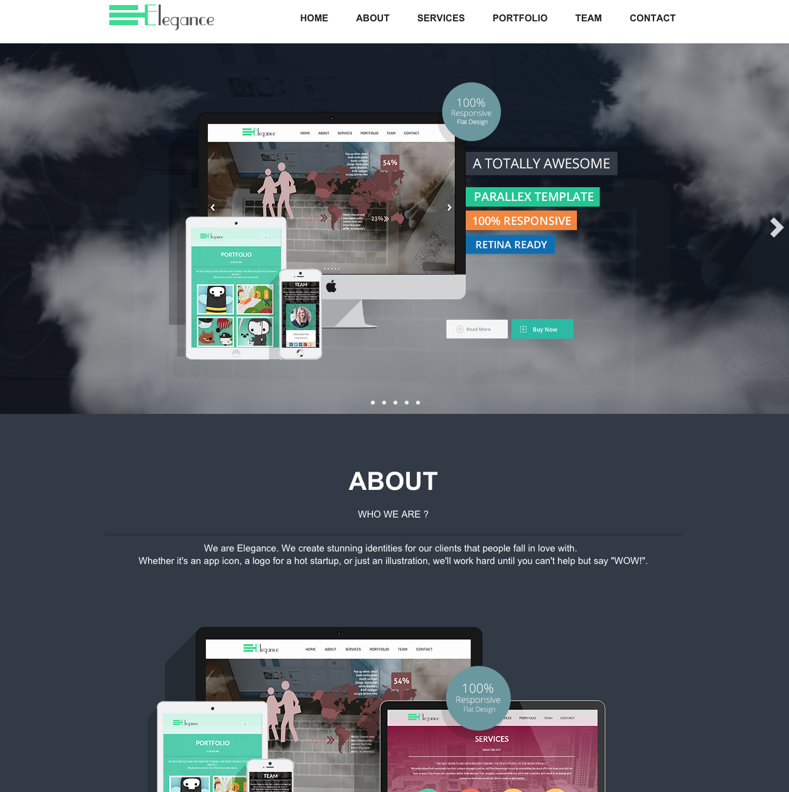
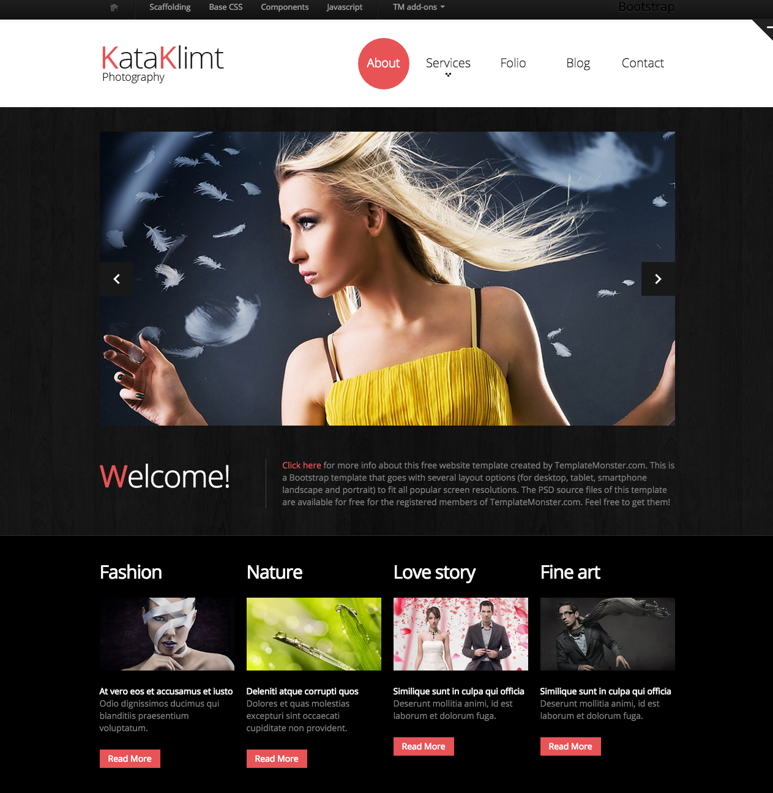
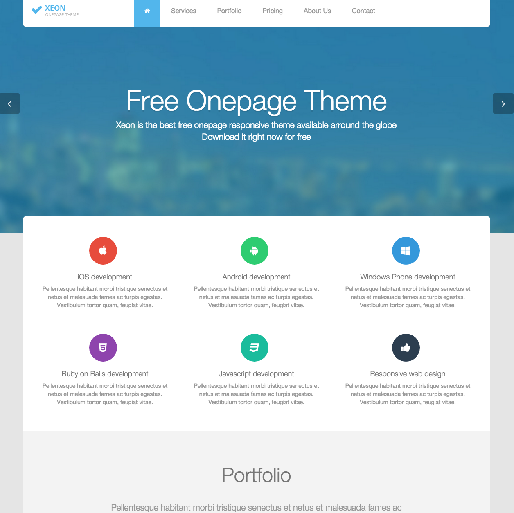

# Awesome Bootstrap  

:sparkles: Awesome - A curated list of amazing Bootstrap tools and themes.

Bootstrap version is denoted by :three: or :four: emoji.

## Table of Contents

- [Contributions](#contributions)
- [Libraries](#libraries)
- [UI Kits](#ui-kits)
- [Templates](#templates)
  - [Single Page Templates](#single-page-templates)
  - [Admin Dashboards](#admin-dashboards)
  - [Retro Themes](#retro-themes)  
- [External Lists](#external-lists)
- [License](#license)
- [Maintainers](#license)

## Contributions

To contibute please see the [contributing.md](contributing.md) document.

## Libraries

- :four: [Bootstrap-Vue](https://github.com/pi0/bootstrap-vue) Complete Components For Vue.js 2. 2.x compatible 
- :four: [ng-bootstrap](https://github.com/ng-bootstrap/ng-bootstrap) Angular directives specific to Bootstrap 4 (Angular 2) 
- :three: [angular-ui/bootstrap](https://github.com/angular-ui/bootstrap) Native AngularJS (version 1) directives for Bootstrap. 

## UI Kits
*These aren't full out-of-the-box themes, rather, they are components you can use in your own creations.*
- :four: [CodexUI](https://codexui.com/) [[1]](#full-disclosure) - Vanilla Bootstrap components that require no extra CSS or Javascript to use. 
- :three: [Flat UI](http://designmodo.github.io/Flat-UI/) - Flat UI is based on Bootstrap, a comfortable, responsive, and functional framework that simplifies the development of websites.   & 
- :three: [todc-bootstrap](https://github.com/todc/todc-bootstrap) - Google-styled theme for Bootstrap. 

## Templates

### Single Page Templates
| Version | Name | Screenshot | Description | LicenseInUse |
| ------- | ---- | ---------- | ----------- | ------------ |
| :four: | [agency](http://startbootstrap.com/template-overviews/agency/) |  | Agency is a one page agency portfolio theme for Bootstrap created by Start Bootstrap. This theme features several content sections, a responsive portfolio grid with hover effects, full page portfolio item modals, a responsive timeline, and a working PHP contact form. |  |
|| [Amoeba](http://www.bootstrapzero.com/bootstrap-template/amoeba) |  |||
|| [Brushed](http://www.alessioatzeni.com/blog/brushed-template/) |  |||
|| [elegance](http://shapebootstrap.net/item/elegance-responsive-one-page-html-template/) |  |||
|| [Essentia](http://bootstrapmaster.com/themes/free-bootstrap-themes/essentia-free-bootstrap-template/) |  |||
|| [Flat Theme Responsive](http://shapebootstrap.net/item/flat-theme-free-responsive-multipurpose-site-template/) |  |||
|| [Flatty](http://www.blacktie.co/2013/12/flatty-app-landing-page/) |  |||
|| [freelancer](http://startbootstrap.com/template-overviews/freelancer/) |  |||
|| [Gotya](http://bootstrapmaster.com/themes/free-bootstrap-themes/gotya-free-bootstrap-theme/) |  |||
|| [Grayscale](http://startbootstrap.com/template-overviews/grayscale/) |  |||
|| [Landing Page](http://startbootstrap.com/landing-page) |  |||
|| [Legend](http://www.dzyngiri.com/legend-free-responsive-one-page-template/) |  |||
|| [Link Agency](http://www.blacktie.co/2013/11/link-bootstrap-3-agency-theme/) |  |||
|| [Minimal Dark](http://www.bootstrapzero.com/bootstrap-template/minimal-dark) |  |||
|| [Munter](http://www.bootstrapzero.com/bootstrap-template/munter) |  |||
|| [Nova](http://shapebootstrap.net/item/nova-multipurpose-site-template/) |  |||
|| [Passion](http://ortheme.com/passion-free-bootstrap-theme/) |  |||
|| [Produkta](http://azmind.com/2013/04/06/free-template-produkta-responsive-bootstrap-product-showcase/) |  |||
|| [Responsive Photography](http://blog.templatemonster.com/2012/11/19/free-bootstrap-responsive-template-photography/) |  |||
|| [Shield](http://www.blacktie.co/2014/02/shield-one-page-theme/) |  |||
|| [Slidefolio](http://bootstrap3themes.quora.com/Slidefolio-%E2%80%93-One-Page-Free-Responsive-Bootstrap-3-Portfolio-Theme) |  |||
|| [Spot](http://www.blacktie.co/2013/10/spot-freelance-agency-theme/) |  |||
|| [Stanley Freelancer](http://www.blacktie.co/2014/01/stanley-freelancer-theme/) |  |||
|| [Stylish portfolio](http://startbootstrap.com/template-overviews/stylish-portfolio/) |  |||
|| [techro](http://webthemez.com/techro-free-responsive-bootstrap-web-template/) |  |||
|| [Xeon](http://shapebootstrap.net/item/xeon-best-onepage-site-template/) |  |||

### Admin Dashboards
| Version | Name | Screenshot | Description | LicenseInUse |
| ------- | ---- | ---------- | ----------- | ------------ |
|| [Blur Admin](https://github.com/akveo/blur-admin) |  |||
|| [Gentelella](https://github.com/puikinsh/gentelella) |  |||
|| [lightway](http://www.prepbootstrap.com/bootstrap-theme/lightway-admin) |  |||
|| [Responsive Dashboard](https://github.com/Ehesp/Responsive-Dashboard) |  |||
|| [ng2-admin](https://github.com/akveo/ng2-admin) | |||

### Retro Themes
| Version | Name | Screenshot | Description | LicenseInUse |
| ------- | ---- | ---------- | ----------- | ------------ |
|:two: :three:| [BOOTSTRA.386](https://kristopolous.github.io/BOOTSTRA.386/) |  |A vintage 1980s DOS inspired Twitter Bootstrap theme||

### External Lists
*I'll list any source lists here to help generate some traffic to them too.*
- [35-best-free-bootstrap-themes](http://www.downloadnewthemes.com/2014/08/35-best-free-bootstrap-themes.html)
- [40 Free Bootstrap Themes to Jump Start Your Web Design Project](http://savedelete.com/2014/08/15/free-bootstrap-themes/174529)
- [Free Bootstrap Themes](http://www.bootstrappage.com/free_bootstrap_templates.php)
- [75+ Free Bootstrap HTML5 Website Templates](http://webdesignwheel.com/free-bootstrap-html5-website-templates.html)

## License

[cc-by-4  - Too Long Didn't Read Version](https://tldrlegal.com/license/creative-commons-attribution-4.0-international-(cc-by-4)).

## Maintainers

List started with :heart: by [therebelrobot](https://github.com/therebelrobot). 

 

List maintained with :heart: by [shadowcodex](https://github.com/shadowcodex).  

 

Contact shadowcodex or file an issue to contact maintainers.

#### Full-Disclosure
With a low community adoption rate of < 10 stars, it should be pointed out that shadowcodex is the sole contributor of CodexUI and it's being added because of contributor overlap. 