
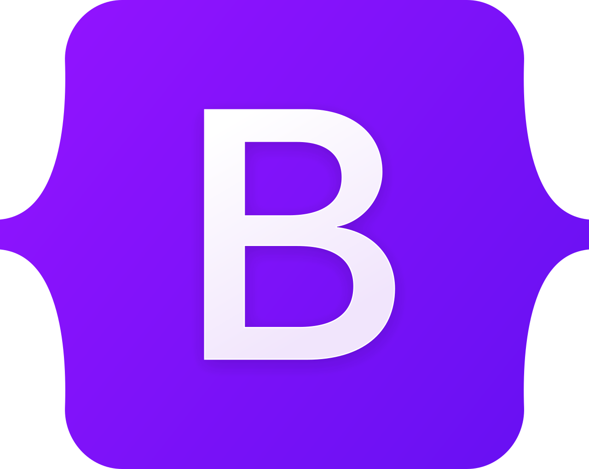

# Awesome Bootstrap  

:sparkles: Awesome - A curated list of amazing Bootstrap tools and themes.

Bootstrap version is denoted by :three: :four: or :five: emoji.

## Table of Contents

- [Contributions](#contributions)
- [Components](#components)
- [Libraries](#libraries)
- [UI Kits](#ui-kits)
- [Templates](#templates)
  - [Single Page Templates](#single-page-templates)
  - [Admin Dashboards](#admin-dashboards)
  - [Retro Themes](#retro-themes)  
  - [Popular website clones](#popular-website-clones)
- [External Lists](#external-lists)
- [Playgrounds](#playgrounds)
- [Design Tools](#design-tools)
- [License](#license)
- [Maintainers](#license)

## Contributions

To contibute please see the [contributing.md](contributing.md) document. 

## Components

-  :five: [Card UX/UI](https://card-ux.mdbgo.io/) - Discover 20+ predefined templates or generate your custom card. 
-  :five: [Ultimate Footer](https://footer.mdbgo.io/) - the last but not least. Learn how the bottom of your page should be at the top of your priorities 
-  :five: [Tables Generator & Templates](https://tables-generator.mdbgo.io/) - Use 10+ templates and present your data in a more accessible way or generate your own table
 
- :three: [bootstrap-datepicker](https://github.com/uxsolutions/bootstrap-datepicker) - A datepicker for twitter bootstrap 
- :two::three: [boostrap-table](https://github.com/wenzhixin/bootstrap-table) - An extended Bootstrap table with radio, checkbox, sort, pagination, and other added features. 

## Libraries
- :five: [Bootstrap 5 & Angular 11](https://github.com/mdbootstrap/mdb-angular-ui-kit) - 500+ free material UI components & templates. 
- :five: [Bootstrap 5 & React 17](https://github.com/mdbootstrap/mdb-react-ui-kit) - 600+ free material UI components & templates. 
- :five: [Bootstrap 5 & Vue 3](https://github.com/mdbootstrap/mdb-vue-ui-kit) - 500+ free material UI components & templates. 
- :four: [Bootstrap 4 & jQuery 3](https://github.com/mdbootstrap/material-design-for-bootstrap) - 600+ free material UI components & templates. 
- :four: [Bootstrap 4 & Angular 10](https://github.com/mdbootstrap/mdb4-angular-ui-kit) - 400+ free material UI components & templates. 
- :four: [Bootstrap 4 & React 16](https://github.com/mdbootstrap/mdb4-react-ui-kit) - 500+ free material UI components & templates. 
- :four: [Bootstrap 4 & Vue 2](https://github.com/mdbootstrap/mdb4-vue-ui-kit) - 400+ free material UI components & templates. 
- :four: [Bootstrap-Vue](https://github.com/pi0/bootstrap-vue) Complete Components For Vue.js 2. 2.x compatible 
- :four: [ng-bootstrap](https://github.com/ng-bootstrap/ng-bootstrap) Angular directives specific to Bootstrap 4 (Angular 2) 
- :four: [reactstrap](https://github.com/reactstrap/reactstrap) - Stateless React Components for Bootstrap 4. 
- :three: [angular-ui/bootstrap](https://github.com/angular-ui/bootstrap) Native AngularJS (version 1) directives for Bootstrap. 
- :three: [react-bootstrap](https://github.com/react-bootstrap/react-bootstrap) - Bootstrap 3 components built with React. 

## UI Kits
*These aren't full out-of-the-box themes, rather, they are components you can use in your own creations.*
- :five: [Material Design for Bootstrap](https://github.com/mdbootstrap/mdb-ui-kit) - 700+ free material UI components & templates. 
- :four::three::two: [BootSnipp.com](https://bootsnipp.com/) - Design elements, playground and code snippets for Bootstrap HTML/CSS/JS framework. 
- :four: [CodexUI](https://codexui.com/) [[1]](#full-disclosure) - Vanilla Bootstrap components that require no extra CSS or Javascript to use. 
- :three: [Flat UI](http://designmodo.github.io/Flat-UI/) - Flat UI is based on Bootstrap, a comfortable, responsive, and functional framework that simplifies the development of websites.   & 
- :three: [todc-bootstrap](https://github.com/todc/todc-bootstrap) - Google-styled theme for Bootstrap. 
- :three: [bootswatch](https://bootswatch.com/) - Bootswatch is a collection of open source themes for Bootstrap. 

## Templates
**IMPORTANT:** For items marked with  please visit their site to learn more about their license.

### Single Page Templates
| Version | Name | Screenshot | Description | LicenseInUse |
| ------- | ---- | ---------- | ----------- | ------------ |
| :five: | [Jumbtron](https://mdbootstrap.com/snippets/standard/mdbootstrap/2515510/) | 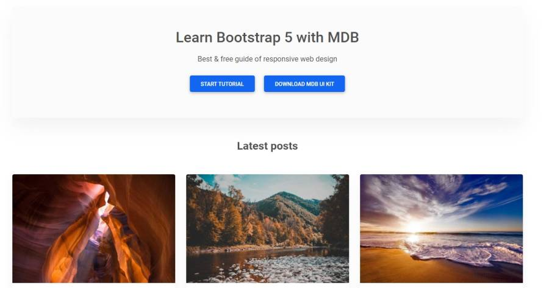| Responsive jumbotron built with the latest Bootstrap 5. A starter template with a full-width centered card at the top.||
| :five: | [Blog Categories](https://mdbootstrap.com/snippets/standard/mdbootstrap/2515508/) | 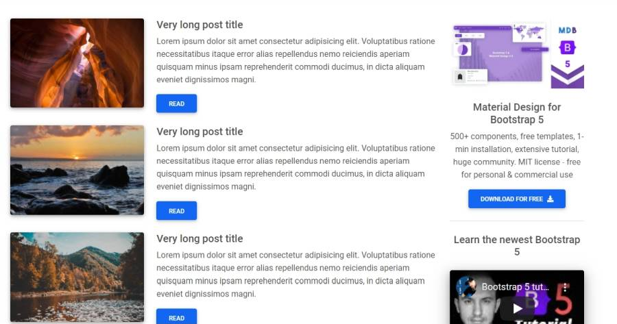| Categories page with the latest Bootstrap 5. A starter template for showing the categories of a given blog, magazine, or other kinds of pages.||
| :five: | [Pricing](https://mdbootstrap.com/snippets/standard/mdbootstrap/2515552/) | 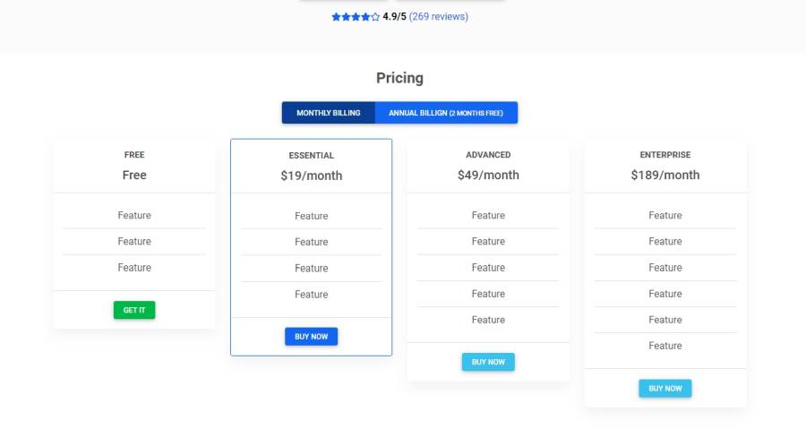| Responsive pricing example built with the latest Bootstrap 5. This template contains tiers for different prices of products, subscriptions, or saas.||
| :five: | [Blog](https://mdbootstrap.com/snippets/standard/mdbootstrap/2515504/) | 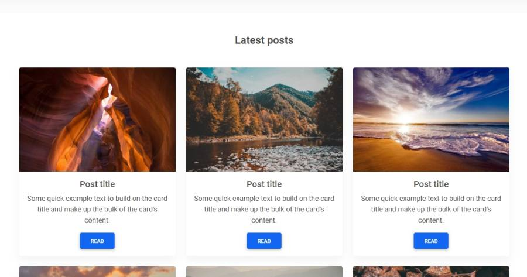| Responsive blog built with the latest Bootstrap 5. Open source template for personal or commercial blog.||
| :five: | [Coming Soon](https://mdbootstrap.com/snippets/standard/mdbootstrap/2515515/) | 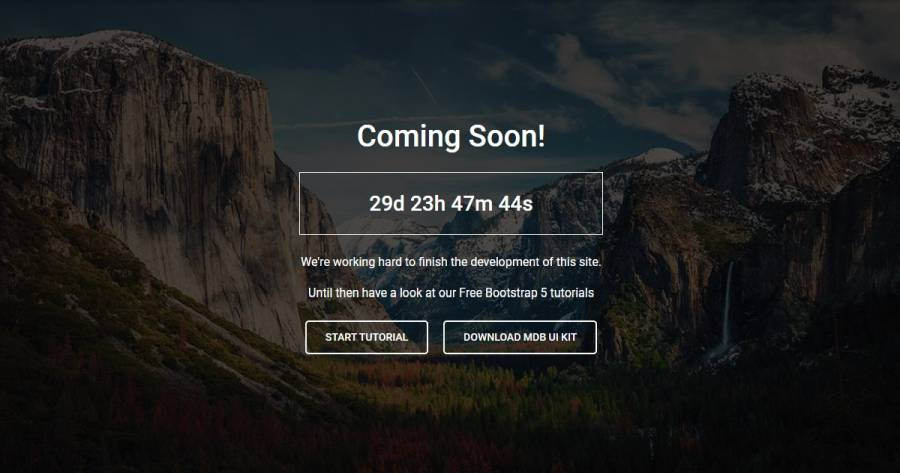| Responsive counter template built with the latest Bootstrap 5. It counts down to the given date in a "coming soon" style.||
| :five: | [Fluent Design](https://mdbgo.io/marta-szymanska/mdb5-demo-free-fluent/free/components/full-demo.html) | 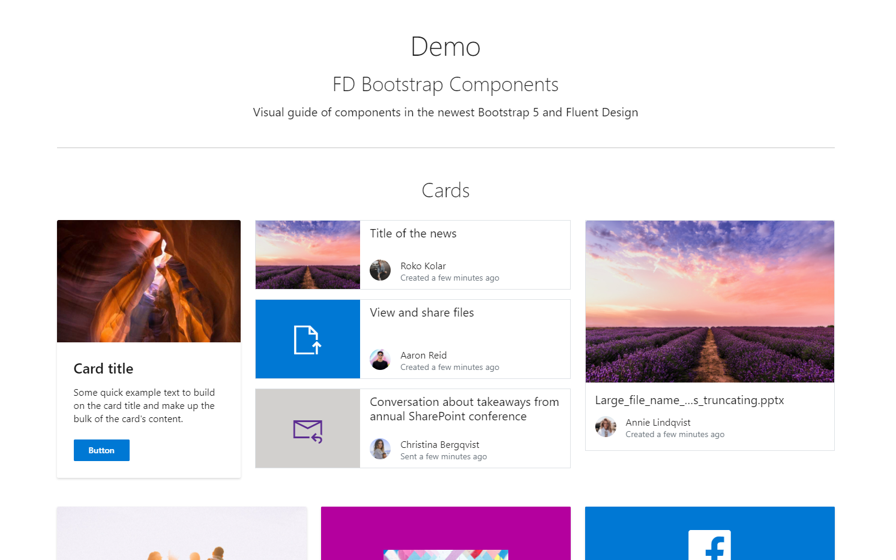|Components in the newest Bootstrap 5 and Fluent Design. Completely new design using the latest Bootstrap.||
| :five: | [Login page](https://mdbootstrap.com/snippets/standard/mdbootstrap/2515540/) | | Responsive, login page template built with the latest Bootstrap 5. Signup/Registration form examples with validation.||
| :five: | [Video full-page Cover](https://mdbootstrap.com/snippets/standard/mdbootstrap/2515523/) | 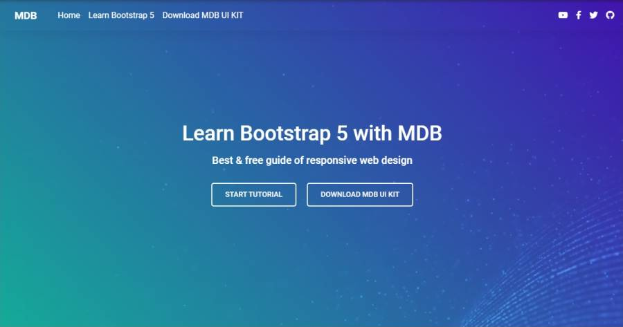 | Responsive fullscreen video template built with the latest Bootstrap 5. This full-page video example will take up the entire viewport of your user screen.||
| :five: | [Bootstarters](https://www.bootstarters.com/) | 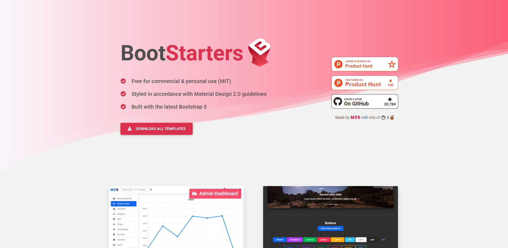 | Bootstarters - Free templates built with the latest Bootstrap 5 and  styled in accordance with Material Design 2.0 guidelines ||
| :five: | [Dark Theme](https://mdbootstrap.com/snippets/standard/mdbootstrap/2922363) | 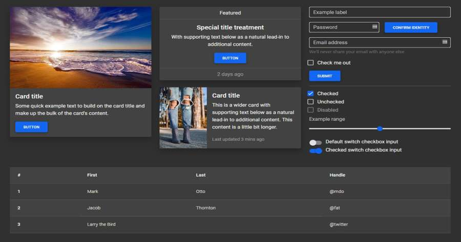 | Dark theme for the components of the newest Bootstrap 5. Carefully selected colors, together creating a beautiful dark composition. ||
| :five: | [Page with Carousel](https://mdbootstrap.com/snippets/standard/mdbootstrap/2515519/) | 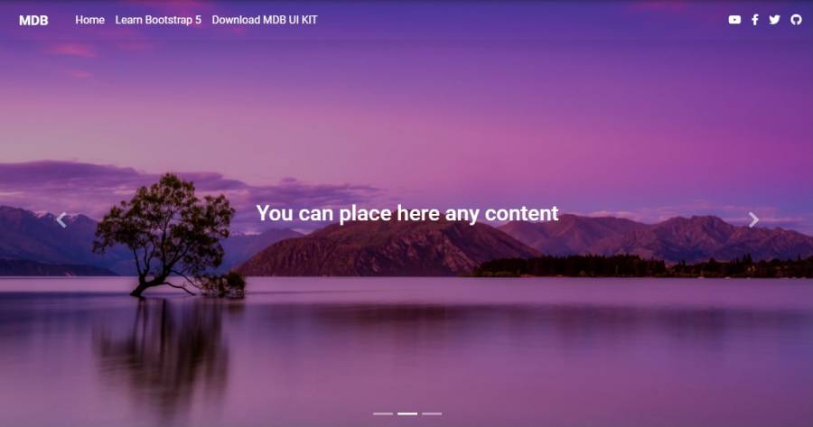 | Responsive, background-image carousel template built with the latest Bootstrap 5. Use a full-page image slider as the first thing the user sees on your website. ||
| :five: | [Image full-page cover](https://mdbootstrap.com/snippets/standard/mdbootstrap/2515521) | 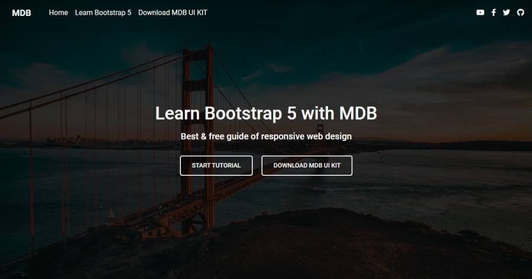 | Responsive, background-image template built with the latest Bootstrap 5. Use this example of a full-page image as a header of your page. ||
| :five: | [Blog Post](https://mdbootstrap.com/snippets/standard/mdbootstrap/2515550/) | 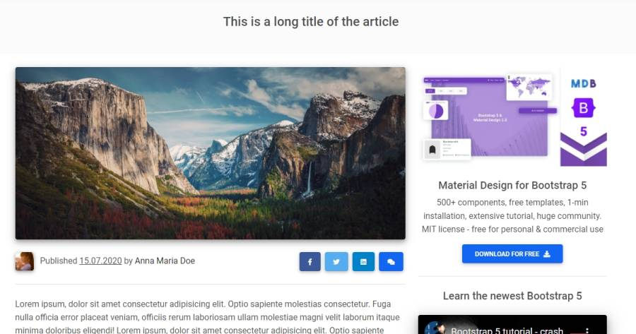 | Responsive, blogpost example built with the latest Bootstrap 5. Use this starter template for Bootstrap blogs, articles, and posts. ||
| :five: | [Magazine](https://mdbootstrap.com/snippets/standard/mdbootstrap/2515545/) | | Responsive magazine template built with the latest Bootstrap 5. News aggregator frontpage for articles, blogposts, and more.||
| :four: | [Landing Page](http://startbootstrap.com/landing-page) |  |Landing Page is a responsive landing page theme for Bootstrap 4.||
| :four: | [Stylish portfolio](http://startbootstrap.com/template-overviews/stylish-portfolio/) |  |Stylish Portfolio is a one page Bootstrap portfolio theme with off canvas navigation and smooth scrolling through content sections.||
| :four: | [agency](http://startbootstrap.com/template-overviews/agency/) |  | Agency is a one page agency portfolio theme for Bootstrap created by Start Bootstrap. This theme features several content sections, a responsive portfolio grid with hover effects, full page portfolio item modals, a responsive timeline, and a working PHP contact form. |  |
| :four: | [freelancer](http://startbootstrap.com/template-overviews/freelancer/) |  |Freelancer is a one page Bootstrap portfolio theme for freelancers.| |
| :four: | [Grayscale](http://startbootstrap.com/template-overviews/grayscale/) |  |Grayscale is a multipurpose, one page website theme featuring a dark layout along with smooth scrolling page animations.||
| :three: | [Amoeba](http://www.bootstrapzero.com/bootstrap-template/amoeba) |  |Amoeba is a free Bootstrap template from BootstrapTaste. Amoeba is one page site template built from Bootstrap 3 with modern flat style also coming with lot of premium features.||
| :three: | [Flat Theme Responsive](http://shapebootstrap.net/item/flat-theme-free-responsive-multipurpose-site-template/) |  |Flat Theme is the best free responsive site template ever. This clean yet elegant design template has been developed using Twitter Bootstrap 3 framework. This template is perfect for any business, corporate or small company site. You can use this template for your personal or clients project.||
| :three: | [Link Agency](http://www.blacktie.co/2013/11/link-bootstrap-3-agency-theme/) |  |Link is a complete agency theme. Show your work with style and in a beautiful way. Create a handsome site with the 6 pages included in this theme. Includes Font Awesome 4, CSS Animation & more.||
| :three: | [Minimal Dark](http://www.bootstrapzero.com/bootstrap-template/minimal-dark) |  |Minimal is a Bootstrap template from BlackTie. Minimal is a simple and small theme. Ideal for a contact page or minimal site. This theme was designed for those wanting something different more than the habitual information page.||
| :three: | [Munter](http://www.bootstrapzero.com/bootstrap-template/munter) |  |Munter is another Bootstrap template from BlackTie. Munter is a very handsome Bootstrap 3 theme with a centered navbar. Comes with beautiful features like a fixed arrows navigation, a nice portfolio showcase and a smooth scroll.||
| :three: | [Passion](http://ortheme.com/passion-free-bootstrap-theme/) |  |Passion, is a responsive and multi-purpose site theme which is suitable for Business & Minimal websites. It’s HTML templates with unique features, such as About, Portfolio, Services,and much more…||
| :three: | [Shield](http://www.blacktie.co/2014/02/shield-one-page-theme/) |  |Shield is an one page theme, ideal for agencies and freelancers. Elegant and with a fresh style. Uses the beautiful icomoon fonts.||
| :three: | [Slidefolio](http://bootstrap3themes.quora.com/Slidefolio-%E2%80%93-One-Page-Free-Responsive-Bootstrap-3-Portfolio-Theme) |  |Slidefolio is Responsive One Page Portfolio Theme Based on twitter bootstrap 3 framework. Slidefolio is loaded with jQuery Background slider, contact form with jQuery validation and beautifully designed for company or personal portfolio page.||
| :three: | [Spot](http://www.blacktie.co/2013/10/spot-freelance-agency-theme/) |  |Spot is flat & handsome theme. Designed for freelancers or small agencies, Spot looks awesome in your browser or mobile device. It comes with cool stuff like charts, pricing tables, font awesome 4.0 and more.||
| :three: | [Stanley Freelancer](http://www.blacktie.co/2014/01/stanley-freelancer-theme/) |  |Stanley is a really simple theme for those wanting to showcase their work with a cute & clean style.||
| :three: | [techro](http://webthemez.com/techro-free-responsive-bootstrap-web-template/) |  |Techro is a business/corporate bootstrap responsive multi page website/ template build with Bootstrap3.1.1, HTML5 & CSS3 and jQuery. It’s a perfect template for corporate, business, web agencies, digital studios, product showcase and personal portfolio.||
| :three: | [Flatty](http://www.blacktie.co/2013/12/flatty-app-landing-page/) |  |Flatty is a flat landing page designed to show your next app, site or product. With a fresh style & minimal design, you can now show your product with style.||
| :two: | [Brushed](http://www.alessioatzeni.com/blog/brushed-template/) |  |Brushed is Free One Page Responsive HTML Template based on Twitter Bootstrap Framework. It is optimized for Retina Displays ( iPhone, iPad, iPod Touch and MacBook Pro Retina).||
| :two: | [Essentia](http://bootstrapmaster.com/themes/free-bootstrap-themes/essentia-free-bootstrap-template/) |  |Essentia Responsive Bootstrap Theme is an ultra responsive,  Twitter Bootstrap Theme that everybody wants. It’s an incredible theme that helps you transform your website into your unique business tool.||
| :two: | [Gotya](http://bootstrapmaster.com/themes/free-bootstrap-themes/gotya-free-bootstrap-theme/) |  |GotYA is just like you, no matter what you feel or what you do, it’s good to know that the bootstrap theme will follow you. It’s well balanced free bootstrap theme with additional features offered by other vendors in premium templates.||
| :two: | [Produkta](http://azmind.com/2013/04/06/free-template-produkta-responsive-bootstrap-product-showcase/) |  |This theme is perfect for launching your new product or service and it comes with four different templates: video, mobile/iphone app, ebook and coming soon.||

### Admin Dashboards
| Version | Name | Screenshot | Description | LicenseInUse |
| ------- | ---- | ---------- | ----------- | ------------ |
|:five:| [Bootstrap 5 Admin Template](https://startbootstrap.com/template-overviews/sb-admin-2/) |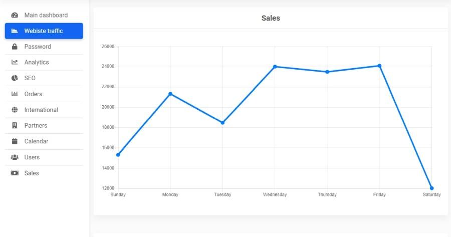|Responsive admin dashboard built with the latest Bootstrap 5. Control panel theme ideal for admin pages, analytics & configuration panels.||
|:four:| [ngx-admin](https://github.com/akveo/ngx-admin) | |Admin dashboard template based on Nebular framework (Angular 4+, Bootstrap 4) previously known as ng2-admin||
|:four:| [react-reduction](https://github.com/reduction-admin/react-reduction) ||Admin Dashboard built with ReactJS + Bootstrap4 + Create React App||
|:four:| [sb-admin](https://startbootstrap.com/template-overviews/sb-admin/) ||SB Admin is a free to download Bootstrap admin template. This template uses the defaul Bootstrap 4 styles along with a variety of powerful jQuery plugins to create a pwerful framework for creating admin panels, web apps, or back-end dashboards.||
|:three:| [Blur Admin](https://github.com/akveo/blur-admin) |  |Customizable admin panel framework made with :heart: by Akveo team. Follow us on Twitter to get latest news about this template first!||
|:three:| [Gentelella](https://github.com/puikinsh/gentelella) |  |Gentelella Admin is a free to use Bootstrap admin template. This template uses the default Bootstrap 3 styles along with a variety of powerful jQuery plugins and tools to create a powerful framework for creating admin panels or back-end dashboards.||
|:three:| [lightway](http://www.prepbootstrap.com/bootstrap-theme/lightway-admin) |  |This is an extended Bootstrap admin theme, which uses a light color collection.||
|:three:| [Responsive Dashboard](https://github.com/Ehesp/Responsive-Dashboard) |  |AngularJS implementation of the RDash admin dashboard theme ||
|:three:| [sb-admin2](https://startbootstrap.com/template-overviews/sb-admin-2/) ||SB Admin 2 Bootstrap admin theme, dashboard template, or webapp UI starter. The theme features a variety of custom jQuery plugins to add extended functionality past the built in Bootstrap UI features.||

### Retro Themes
| Version | Name | Screenshot | Description | LicenseInUse |
| ------- | ---- | ---------- | ----------- | ------------ |
|:three: :two:| [BOOTSTRA.386](https://kristopolous.github.io/BOOTSTRA.386/) |  |A vintage 1980s DOS inspired Twitter Bootstrap theme||

### Popular website clones
| Version | Name | Screenshot | Description | LicenseInUse |
| ------- | ---- | ---------- | ----------- | ------------ |
|:five:|[Twitter newsfeed](https://mdbootstrap.com/snippets/standard/mdb-lab/2867455) | 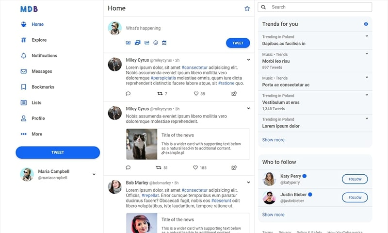 |The project includes a home page with three column layout where the two extreme ones are responsible for the navigation, while the middle one i cards you can check recent user activity.||
|:five:|[Tripadvisor homepage](https://mdbootstrap.com/snippets/standard/mdb-lab/2867464) | 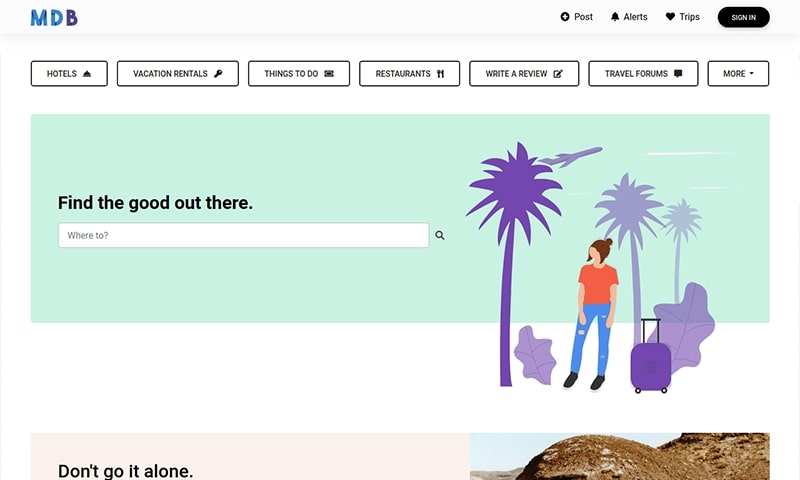 |The project includes a home page with one column layout with easy to use navigation in shortcuts under the navbar. The page includes also a search form & number of cards with advised the best places to rest.||
|:five:|[Wikipedia article page](https://mdbootstrap.com/snippets/standard/mdb-lab/2867452) | 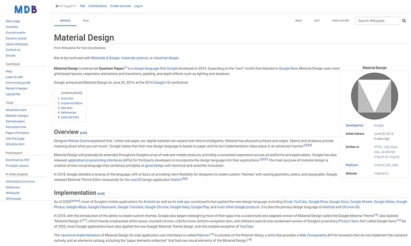 |The project includes a home page with typical, advanced eCommerce navigation (double navbar + sidenav) and multiple media containers for presenting products.||
|:five:|[IMDB homepage](https://mdbootstrap.com/snippets/standard/mdb-lab/2847268) | 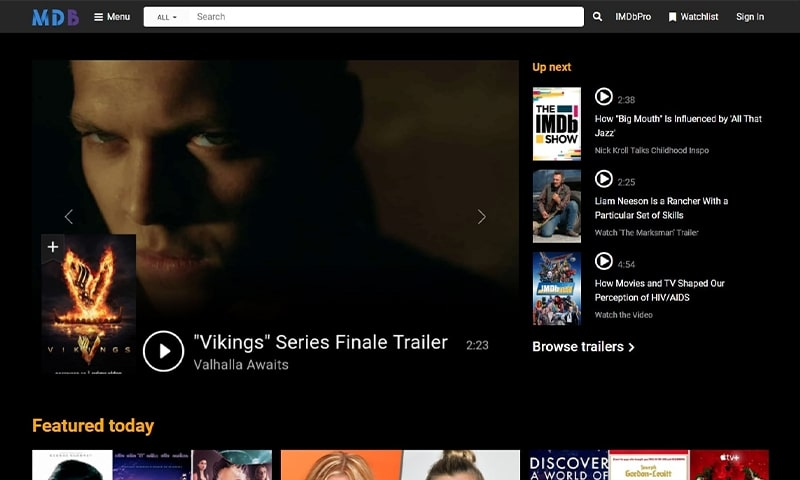 |The project includes a home page with typical, advanced navigation and multiple media containers for presenting news and movies.||
|:five:|[Airbnb](https://mdbootstrap.com/snippets/standard/mdb-lab/2847266) | 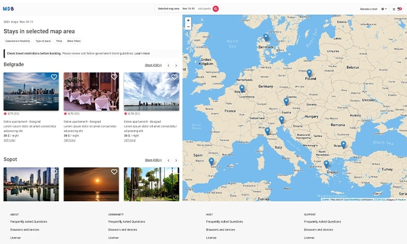 |The project includes two-column layout with advanced navigation of multiple media containers for presenting places to stay in area you can choose on interactive map.||
|:five:|[Facebook messenger](https://mdbootstrap.com/snippets/standard/mdb-lab/2847260) | 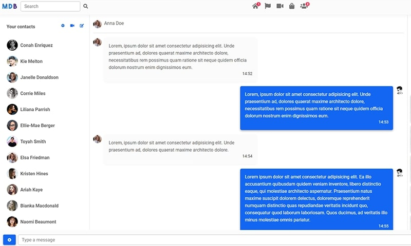 |The project includes typical three column layout with interface to send messages and exchange photos, videos, stickers, audio, and files, as well as react to other users' messages.||
|:five:|[Facebook profile page](https://mdbootstrap.com/snippets/standard/mdb-lab/2847258) | 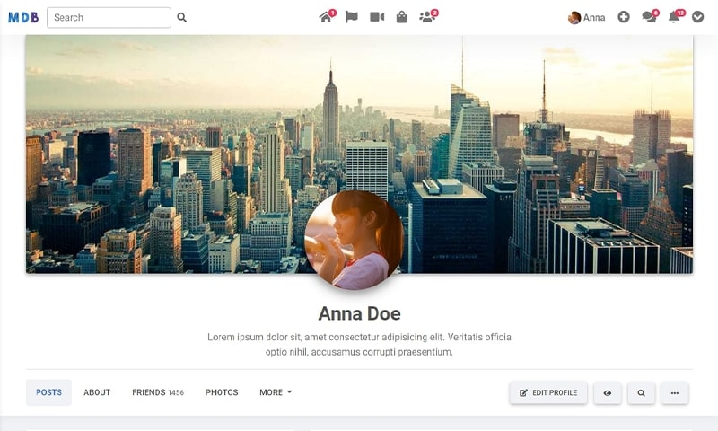 |The project includes the user's profile page, along with the top navigation, cover photo, profile photo, and below that typical two-column layout with account information, and user news feed.||
|:five:|[Instagram newsfeed](https://mdbootstrap.com/snippets/standard/mdb-lab/2847257) | 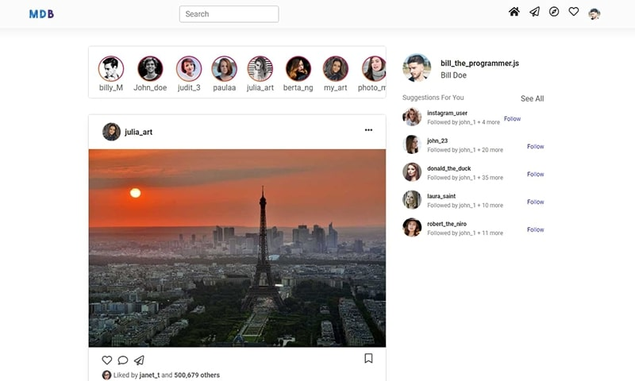 |The project includes the user's newsfeed, along with the typical two-column layout, story row and navigation.||
|:five:|[YouTube homepage](https://mdbootstrap.com/snippets/standard/mdb-lab/2847265) | 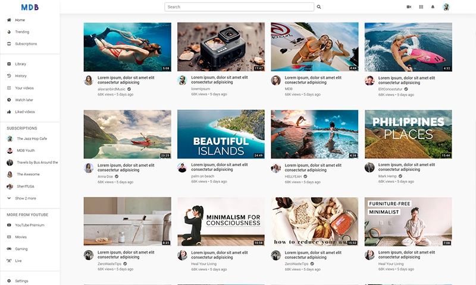 |The project includes a home page with typical, advanced YouTube navigation and multiple media containers for presenting videos.||
|:five:|[Trello board](https://mdbootstrap.com/snippets/standard/mdb-lab/2847259) | 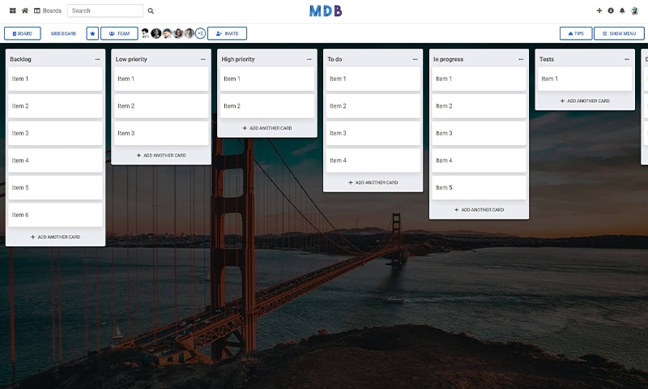 |The project includes trello board with a typical scrum system arrangement and draggable tasks.||
|:five:|[Alibaba homepage](https://mdbootstrap.com/snippets/standard/mdb-lab/2847264) | 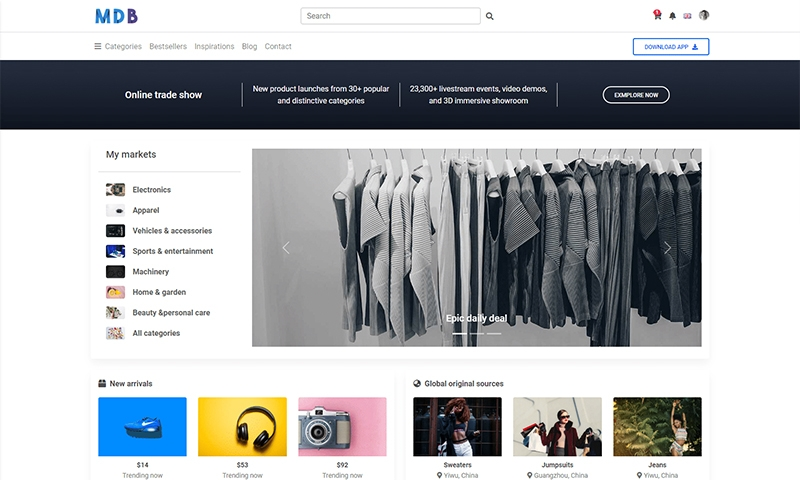 |The project includes a home page with typical, advanced eCommerce navigation (double navbar + sidenav) and multiple media containers for presenting products.||
|:five:|[Facebook newsfeed](https://mdbootstrap.com/snippets/standard/mdb-lab/2847263) | 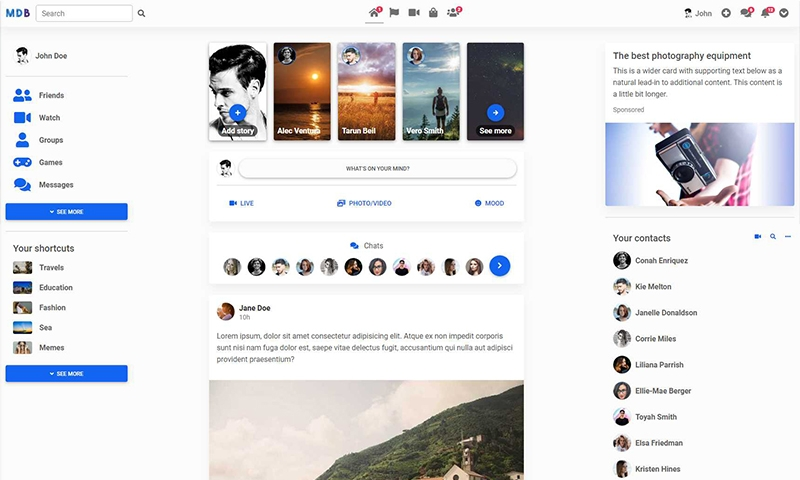 |The project includes the user's newsfeed, along with the typical three-column layout and social media navigation.||
|:five:|[Amazon homepage](https://mdbootstrap.com/snippets/standard/mdb-lab/2847262) | 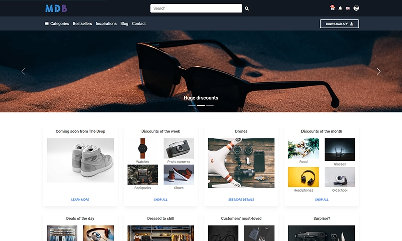 |The project includes a home page with typical, advanced eCommerce navigation (double navbar + sidenav) and multiple media containers for presenting products.||

### Playgrounds & hosting

- [Codeply](https://www.codeply.com/p/3NtYJhNZCd) - an online editor that includes dozens of frameworks, starter templates and code snippets supports Vuetify, Bulma, Bootstrap, Foundation, MDB, Angular and Vue
- [Snippets Playground](https://mdbootstrap.com/snippets/) - free & fast online editor dedicated to Bootstrap, supports integrations with React, Angular, Vue and MDB, full of community crafted components and design blocks
- [CodePen](https://codepen.io/) - social development environment for front-end designers and developers
- [JSFiddle](https://jsfiddle.net/) - an online IDE service and online community for testing and showcasing user-created and collaborational HTML, CSS and JavaScript code snippets
- [MDB GO/CLI](https://mdbgo.com/) - frontend + backend environment. Create, deploy and host anything with a single command, offers free hosting & predesigned backend boilerplates integrated with **Bootstrap**, Angular, React, Vue, Laravel, WordPress, Express.js, MongoDB, MySQL, Tailwind, Express.js, SocketIO, Passport and more.

### Design Tools

- [Drag & Drop Builder](https://mdbootstrap.com/builder/)
- [Lab Templates](https://mdbootstrap.com/docs/standard/lab/)
- [Color Schemes generator](https://mdbootstrap.com/docs/standard/tools/design/color-schemes/)
- [ProofHub](https://www.proofhub.com/)
- [Logo generator](https://mdbootstrap.com/docs/standard/tools/design/logo-generator/)
- [Filestage](https://filestage.io/)
- [CSS Masks & Glassmorphism Generator](https://mdbootstrap.com/docs/standard/tools/design/masks/)
- [Logaster](https://www.logaster.com/logo/)
- [Instagram filters CSS generator](https://mdbootstrap.com/docs/standard/tools/design/instagram-filters/)
- [Coolors – Color scheme generator](https://coolors.co/)
- [CSS gradients generator](https://mdbootstrap.com/docs/standard/tools/design/gradients/)
- [Palleton – A color scheme](https://paletton.com/)
- [Fancy border radius generator](https://mdbootstrap.com/docs/standard/tools/design/fancy-border-radius/)
- [Diigo](https://www.diigo.com/)
- [Meta tags generator](https://mdbootstrap.com/docs/standard/tools/builders/meta-tags/)
- [Cards generator](https://mdbootstrap.com/docs/standard/tools/builders/cards/)
- [Pixlr](https://pixlr.com/)
- [Buttons generator](https://mdbootstrap.com/docs/standard/tools/builders/buttons/)
- [InVision Studio](https://www.invisionapp.com/studio)
- [Charts creator](https://mdbootstrap.com/docs/standard/tools/builders/charts/)
- [Marvel](https://marvelapp.com/)
- [Shadows generator](https://mdbootstrap.com/docs/standard/tools/design/shadows/)
- [Figma](https://www.figma.com/)
- [SVG waves generator](https://mdbootstrap.com/docs/standard/tools/design/waves/)
- [Affinity Designer](https://affinity.serif.com/en-gb/designer/)
- [Datatables builder](https://mdbootstrap.com/docs/standard/tools/builders/datatables/)
- [UXPin](https://www.uxpin.com/)
- [Alerts generator](https://mdbootstrap.com/docs/standard/tools/builders/alerts/)
- [Proto.io](https://proto.io/)
- [Modals generator](https://mdbootstrap.com/docs/standard/tools/builders/modals/)
- [MockFlow](https://www.creativebloq.com/features/best-web-design-tools)
- [Icons generator](https://mdbootstrap.com/docs/standard/tools/builders/icons/)
- [Adobe Comp](https://www.adobe.com/uk/products/comp.html)
- [Table generator](https://mdbootstrap.com/docs/standard/tools/builders/table/)
- [Flinto](https://www.flinto.com/)
- [Flexbox generator](https://mdbootstrap.com/docs/standard/tools/builders/flexbox/)
- [Justinmind](https://www.justinmind.com/)
- [Footer generator](https://mdbootstrap.com/docs/standard/tools/builders/footer/)
- [Canva](https://www.canva.com/about/)
- [Navbar generator](https://mdbootstrap.com/docs/standard/tools/builders/navbar/)
- [Orion Icon](https://orioniconlibrary.com/)
- [Typography generator](https://mdbootstrap.com/docs/standard/tools/builders/typography/)
- [Squoosh](https://squoosh.app/)
- [Grid generator](https://mdbootstrap.com/docs/standard/tools/builders/grid/)
- [Animation generator](https://mdbootstrap.com/docs/standard/tools/builders/animations/)
- [Ripple generator](https://mdbootstrap.com/docs/standard/tools/builders/ripple/)

### External Lists
*I'll list any source lists here to help generate some traffic to them too.*
- [35-best-free-bootstrap-themes](http://www.downloadnewthemes.com/2014/08/35-best-free-bootstrap-themes.html)
- [40 Free Bootstrap Themes to Jump Start Your Web Design Project](http://savedelete.com/2014/08/15/free-bootstrap-themes/174529)
- [Free Bootstrap Themes](http://www.bootstrappage.com/free_bootstrap_templates.php)
- [75+ Free Bootstrap HTML5 Website Templates](http://webdesignwheel.com/free-bootstrap-html5-website-templates.html)

## License

[cc-by-4  - Too Long Didn't Read Version](https://tldrlegal.com/license/creative-commons-attribution-4.0-international-(cc-by-4)).

## Maintainers

List started with :heart: by [therebelrobot](https://github.com/therebelrobot). 

 

List maintained with :heart: by [shadowcodex](https://github.com/shadowcodex).  

 

Contact shadowcodex or file an issue to contact maintainers.

#### Full-Disclosure
With a low community adoption rate of < 10 stars, it should be pointed out that shadowcodex is the sole contributor of CodexUI and it's being added because of contributor overlap. 
